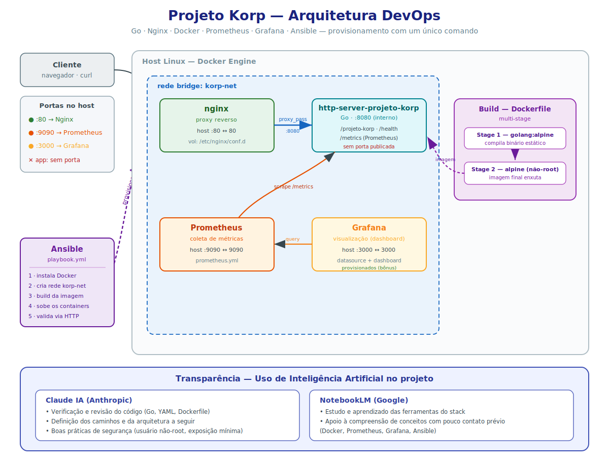

# Projeto Korp — Desafio DevOps

Serviço HTTP em **Go** instrumentado para observabilidade, publicado atrás de um **proxy reverso Nginx**, monitorado com **Prometheus + Grafana** e provisionado de ponta a ponta com **Ansible** — tudo orquestrado via **Docker Compose**.

O ambiente inteiro (instalação do Docker, rede, build, containers, proxy, monitoramento e validação) sobe com **um único comando**.

---

## Arquitetura



Somente o **Nginx** (porta 80), o **Prometheus** (9090) e o **Grafana** (3000) publicam portas no host. O serviço Go **não expõe porta diretamente** — só é acessível pela rede interna `korp-net`. Todo o ambiente é provisionado pelo **Ansible** com um único comando.

---

## Stack

| Componente | Tecnologia |
|------------|------------|
| Serviço HTTP | Go (`net/http`) |
| Métricas | `prometheus/client_golang` |
| Proxy reverso | Nginx (imagem oficial) |
| Containerização | Docker + Docker Compose |
| Monitoramento | Prometheus |
| Visualização | Grafana (datasource + dashboard provisionados) |
| Automação | Ansible |

---

## Estrutura do projeto

```
projeto-korp/
├── main.go                         # serviço HTTP + instrumentação Prometheus
├── go.mod                          # módulo Go e dependências
├── Dockerfile                      # multi-stage build (Alpine, binário estático)
├── docker-compose.yml              # orquestração dos 4 containers
├── nginx/
│   └── conf.d/
│       └── http-server-projeto-korp.conf   # configuração do proxy reverso
├── prometheus/
│   └── prometheus.yml              # scrape config do alvo
├── grafana/
│   └── provisioning/
│       ├── datasources/
│       │   └── datasource.yml      # datasource Prometheus 
│       └── dashboards/
│           ├── dashboards.yml      # provider de dashboards 
│           └── http-server-projeto-korp-dashboard.json
└── ansible/
    ├── ansible.cfg
    ├── inventory.ini
    ├── requirements.yml            # coleção community.docker
    └── playbook.yml                # provisionamento completo
```

---

## Endpoints do serviço

| Método | Rota | Descrição |
|--------|------|-----------|
| GET | `/projeto-korp` | Retorna `{"nome":"Projeto Korp","horario":"<UTC>"}`, com o horário resolvido dinamicamente a cada requisição (RFC3339). |
| GET | `/health` | Endpoint de disponibilidade (`{"status":"ok"}`). |
| GET | `/metrics` | Métricas no formato Prometheus. |

---

## Como executar

### Opção A — Provisionamento automático com Ansible (recomendado)

Faz **tudo** num único comando: instala Docker, cria a rede, builda a imagem, sobe os containers e valida o serviço.

```bash
# pré-requisitos (uma única vez)
sudo apt update && sudo apt install -y ansible
cd ansible
ansible-galaxy collection install -r requirements.yml

# provisionamento completo (um único comando)
sudo ansible-playbook -i inventory.ini playbook.yml
```

Ao final, o playbook faz uma requisição HTTP real e imprime a resposta do serviço no console.

> Observação: usamos `sudo ansible-playbook` (em vez de `--ask-become-pass`) para evitar o timeout do prompt de senha localizado em provisionamento local.

### Opção B — Manualmente com Docker Compose

```bash
# a rede é declarada como external no compose; crie-a primeiro
docker network create korp-net

# build + subida de todos os serviços
docker compose up -d --build
docker compose ps
```

---

## Validação

```bash
# serviço através do proxy reverso (porta 80)
curl http://localhost:80/projeto-korp
# -> {"nome":"Projeto Korp","horario":"2026-..Z"}

# gera tráfego para popular as métricas
for i in $(seq 1 20); do curl -s http://localhost:80/projeto-korp > /dev/null; done

# métricas customizadas
curl -s http://localhost:80/metrics | grep http_requests_total
```

| Interface | URL | Acesso |
|-----------|-----|--------|
| Serviço (via Nginx) | http://localhost:80/projeto-korp | — |
| Prometheus | http://localhost:9090/targets | alvo deve estar **UP** |
| Grafana | http://localhost:3000 | `admin` / `admin` |

No Grafana, o dashboard **"Projeto Korp - Observabilidade"** já aparece provisionado automaticamente.

---

## Monitoramento

Métricas obrigatórias do desafio:

- **Volume de requisições** — counter `http_requests_total{method,path,status}`.
- **Disponibilidade** — endpoint dedicado `/health` + a métrica `up` que o Prometheus gera ao raspar o alvo.

Métrica adicional para enriquecer a análise:

- **Latência** — histogram `http_request_duration_seconds` (usado para p50/p95 no dashboard).

O dashboard do Grafana apresenta: disponibilidade do serviço, total e taxa de requisições (por status e por rota) e latência.

---

## Decisões técnicas

- **Multi-stage build / Alpine:** o `Dockerfile` compila um binário estático (`CGO_ENABLED=0`, `-ldflags "-s -w"`) e o copia para uma imagem Alpine mínima, executando como usuário **não-root** — imagem enxuta e mais segura.
- **App sem porta exposta:** o acesso externo passa obrigatoriamente pelo Nginx, atendendo ao requisito e reduzindo a superfície de exposição.
- **Rede `korp-net` como `external`:** a criação da rede é um passo explícito do playbook Ansible (conforme o desafio), e o Compose a reutiliza.
- **Grafana 100% provisionado:** datasource e dashboard versionados como código (`datasource.yml`, `dashboards.yml`, `*.json`) — sem cliques manuais, reprodutível.
- **Disponibilidade via `/health` + `up`:** combina um sinal interno (endpoint) com o sinal externo de scrape do Prometheus.

---

## Mapeamento com os requisitos do desafio

| Requisito | Onde |
|-----------|------|
| Serviço Go na porta 8080 + `GET /projeto-korp` (JSON, horário UTC dinâmico) | `main.go` |
| Dockerfile (build + execução) | `Dockerfile` |
| Rede Docker bridge | `korp-net` (playbook + compose) |
| Compose com app (sem porta) + Nginx (80, volume em `/etc/nginx/conf.d`) | `docker-compose.yml` |
| Proxy reverso | `nginx/conf.d/http-server-projeto-korp.conf` |
| Métricas (disponibilidade + volume) no padrão Prometheus | `main.go` + `prometheus/prometheus.yml` |
| Prometheus + Grafana no compose | `docker-compose.yml` |
| Dashboard no Grafana | `grafana/provisioning/dashboards/...` |
| Playbook Ansible (provisionamento com um comando) | `ansible/playbook.yml` |
|Grafana provisionado automaticamente | `grafana/provisioning/` |

---

## Transparência — uso de Inteligência Artificial

Este projeto foi desenvolvido com apoio de ferramentas de IA, de forma transparente:

- **Claude IA (Anthropic)** — verificação e revisão do código (Go, YAML, Dockerfile), definição dos caminhos e da arquitetura a seguir, e orientação sobre boas práticas de segurança (execução como usuário não-root, exposição mínima de portas, rede dedicada).
- **NotebookLM (Google)** — estudo e aprendizado das ferramentas do stack (Docker, Prometheus, Grafana e Ansible), com as quais eu tinha pouco contato prévio.

As decisões de arquitetura, a implementação, os testes e a validação do ambiente foram conduzidos e compreendidos por mim; a IA atuou como apoio de revisão e aprendizado.
